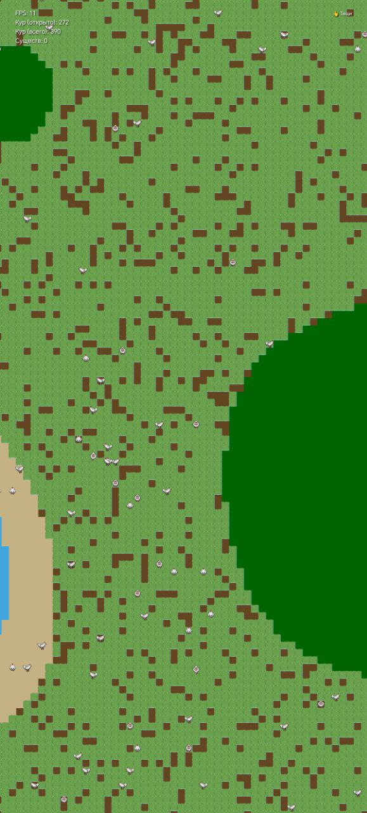

## 🎮 God Simulator v0.2.0


### ⚡ Симулятор бога с процедурной генерацией мира
### 🌍 Бесконечный мир • 🐔 Живые существа • 🌱 Растущая экосистема

---

## 📋 Оглавление

- [📖 О проекте](#-о-проекте)
- [✨ Возможности](#-возможности)
- [📸 Демонстрация](#-демонстрация)
- [📥 Установка](#-установка)
- [🔨 Сборка из исходников](#-сборка-из-исходников)
- [🎮 Использование](#-использование)
- [🛠 Технологии](#-технологии)
- [🧱 Архитектура](#-архитектура)
- [🔧 Решение проблем](#-решение-проблем)
- [📄 Лицензия](#-лицензия)
- [📬 Контакты](#-контакты)

---

## 📖 О проекте

**God Simulator** — это песочница с процедурной генерацией мира, где вы наблюдаете за жизнью существ в бесконечном мире.

### 🎯 Основная задача
Исследовать мир, наблюдать за курицами и существами, которые живут своей жизнью в процедурно генерируемых чанках.

### 🔥 Ключевая особенность
Вся генерация мира происходит **на лету** — чанки создаются по мере исследования, а существа продолжают жить даже вне поля зрения игрока.

---

## ✨ Возможности

| Фича | Описание |
|------|----------|
| 🌍 **Процедурный мир** | 8 типов биомов: трава, песок, вода, лес, снег, пустыня, камень, грязь |
| 🐔 **Живые курицы** | Спрайтовая анимация (4 направления × 4 кадра), случайное блуждание |
| 🧍 **Существа** | Люди, животные, монстры с системой потребностей (голод, здоровье, возраст) |
| 🌱 **Рост травы** | Трава растёт каждые 5 секунд, может превратиться в лес |
| 📊 **Счётчики** | Отслеживание открытых и всех существ в мире |
| 🎮 **Управление** | Перемещение камеры касанием (drag), фиксированный зум 1.0x |
| ⚡ **60 FPS** | Оптимизированный игровой цикл на корутинах |

---

## 📸 Демонстрация

| 🏠 Главный экран |
|------------------|
|  |
| *Процедурный мир с курицами и существами* |

---

## 📥 Установка

### ⚡ Готовый APK

```bash
# 1. Скачайте последнюю версию
[](https://github.com/your-username/GodSimulator/releases/latest/download/GodSimulator.apk)

# 2. Установите файл
Разрешите "Установку из неизвестных источников" при первом запуске.
```

### 📦 Требования

| Компонент | Версия |
|-----------|--------|
| 📱 Android | 7.0+ (API 24) |
| 🌐 Интернет | Не требуется |
| 🔐 Разрешения | Нет специальных разрешений |

---

## 🔨 Сборка из исходников

### 🛠 Предварительные требования

- ✓ Android Studio Hedgehog+
- ✓ JDK 11+
- ✓ Android SDK 36
- ✓ Gradle 9.1

### 🚀 Пошаговая сборка

```bash
# 1. Клонируйте репозиторий
git clone https://github.com/your-username/GodSimulator.git
cd GodSimulator

# 2. Откройте в Android Studio
#    Проект автоматически подгрузит зависимости

# 3. Соберите проект
./gradlew build

# 4. Установите на устройство
./gradlew installDebug
```

### ⚙️ Конфигурация (build.gradle.kts)

```kotlin
// Версии
compileSdk = 36
minSdk = 24
targetSdk = 36

// Java
sourceCompatibility = JavaVersion.VERSION_11
targetCompatibility = JavaVersion.VERSION_11

// Корутины
implementation("org.jetbrains.kotlinx:kotlinx-coroutines-android:1.7.3")
```

---

## 🎮 Использование

### 1️⃣ Запуск игры

Приложение автоматически запускает игровой цикл при старте.

### 2️⃣ Управление камерой

| Жест | Действие |
|------|----------|
| 👆 **Один палец (drag)** | Перемещение камеры по миру |
| 🤏 **Щипок** | Отключено (фиксированный зум) |

### 3️⃣ Наблюдение за миром

| Индикатор | Описание |
|-----------|----------|
| 🐔 **Кур (открыто)** | Курицы в посещённых чанках |
| 🐔 **Кур (всего)** | Все курицы в мире (для отладки) |
| 🧍 **Существ** | Все существа в мире |
| ⚡ **FPS** | Кадров в секунду |

### 4️⃣ Исследование мира

- Мир генерируется **бесконечно** по мере перемещения
- Каждый чанк (32×32 тайла) содержит 5-15 куриц
- Курицы продолжают жить даже вне поля зрения
- Трава растёт и может превратиться в лес

---

## 🛠 Технологии

- 📱 **Kotlin** — основной язык разработки
- 🎮 **SurfaceView** — рендеринг игрового мира
- ⚡ **Coroutines** — асинхронный игровой цикл
- 🌍 **Procedural Generation** — процедурная генерация чанков
- 🎨 **Canvas API** — отрисовка графики
- 📦 **AndroidX** — современные компоненты Android

### 📊 Распределение кода

| Язык | Роль |
|------|------|
| 🟣 **Kotlin** | Вся логика игры, рендеринг, управление |
| 🎨 **XML** | Ресурсы, манифест, макеты |

---

## 🧱 Архитектура

```
app/
├── src/main/
│   ├── java/com/printer/godsimulator/
│   │   ├── MainActivity.kt      # Точка входа
│   │   ├── GameView.kt          # Игровой движок (SurfaceView)
│   │   ├── World.kt             # Модель мира (чанки, тайлы)
│   │   ├── GameConfig.kt        # Конфигурация игры
│   │   ├── Chicken.kt           # Курицы (спрайтовая анимация)
│   │   ├── Creature.kt          # Существa (процедурная отрисовка)
│   │   ├── Animation.kt         # Анимация кадров
│   │   └── SpriteManager.kt     # Загрузка спрайтов
│   ├── res/
│   │   ├── drawable/            # Спрайты (chicken_walk.png)
│   │   ├── layout/              # Макеты
│   │   └── values/              # Стили и строки
│   └── AndroidManifest.xml      # Манифест приложения
```

### 🔄 Игровой цикл

```kotlin
// GameView.kt
private fun startGameLoop() {
    gameLoopThread = scope.launch {
        while (isActive && isSurfaceCreated) {
            update()  // Обновление логики
            draw()    // Отрисовка
            delay(16) // 60 FPS
        }
    }
}
```

### 🌍 Генерация чанков

```kotlin
// World.kt
private fun generateChunk(chunkX: Int, chunkY: Int): Array<Array<Tile>> {
    // 1. Генерируем тайлы (шум Перлина + температура)
    // 2. Спавним куриц (5-15 на чанк)
    // 3. Сохраняем в кеш
}
```

---

## 🔧 Решение проблем

### ❌ Ошибка: «StackOverflowError» при запуске

**Причина:** Бесконечная рекурсия в `World.kt` (`spawnChickensInChunk` → `getTile` → `generateChunk`)

**Решение:** Передавать готовый массив чанка вместо вызова `getTile()`:

```kotlin
// ✅ Правильно
private fun spawnChickensInChunk(chunkX: Int, chunkY: Int, chunk: Array<Array<Tile>>) {
    val tile = chunk[localX][localY]  // Берём напрямую
}
```

### ❌ Ошибка: «ANR (Application Not Responding)»

**Причина:** Игровой цикл на `Dispatchers.Main`

**Решение:** Использовать `Dispatchers.Default`:

```kotlin
// ✅ Правильно
private val scope = CoroutineScope(Dispatchers.Default + SupervisorJob())
```

### ❌ Ошибка: «Cannot find a Java installation»

**Причина:** Не настроен toolchain или отсутствует JDK 11

**Решение:** Удалить `kotlin { jvmToolchain(11) }` из `build.gradle.kts`:

```kotlin
// ✅ Правильно
compileOptions {
    sourceCompatibility = JavaVersion.VERSION_11
    targetCompatibility = JavaVersion.VERSION_11
}
```

### ❌ Ошибка: «Unresolved reference» в `libs.versions.toml`

**Причина:** Лишние пробелы в версиях

**Решение:** Убрать пробелы:

```toml
# ❌ Неправильно
agp = "9.0.1 "

# ✅ Правильно
agp = "9.0.1"
```

---

## 📄 Лицензия

[](LICENSE)

Проект распространяется под лицензией MIT.

---

## 📬 Контакты

### 💬 Вопросы по архитектуре или геймплею?

[](https://github.com/Andrey3141)

### 📋 Планы по развитию

| Версия | Статус | Планируемые функции |
|--------|--------|---------------------|
| 0.1.0 | ✅ Выпущена | Базовый движок, PixelMan |
| 0.2.0 | ✅ Выпущена | Чанки, курицы, существа |
| 0.3.0 | ✅ Выпущена | Рост травы, конфиг, счётчики |
| 0.4.0 | 🔄 В разработке | Сохранение мира, взаимодействие |
| 1.0.0 | 📅 В планах | Смена дня/ночи, квесты, звуки |

---

## 🚀 Скачать

[](https://github.com/Andrey3141/God-Simulator/releases)

**God Simulator** — наблюдай за жизнью в бесконечном процедурном мире. 🌍🐔

*Сделано с ❤️ на Kotlin + Android*
